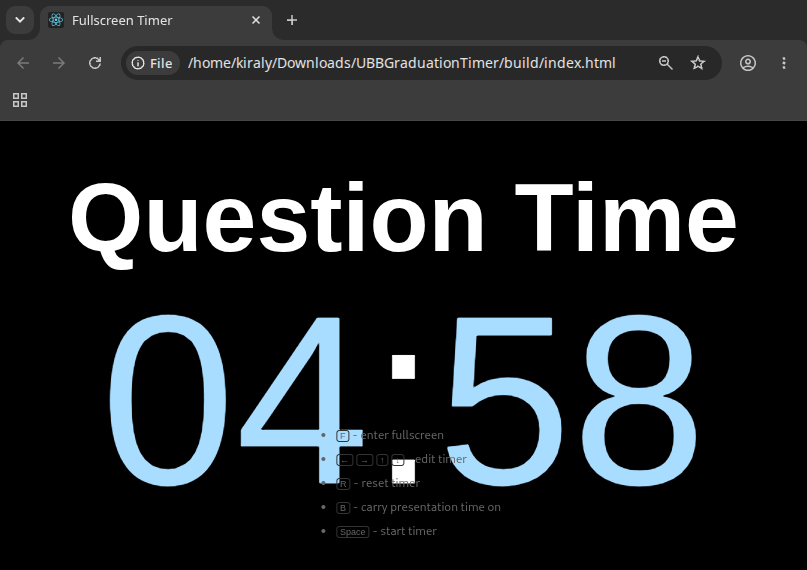

# UBB Graduation Timer

This is a fullscreen countdown timer tailored for UBB graduation presentations. It guides each candidate through a 15-minute presentation stage followed by a 5-minute question time stage, with clear visual cues when either stage runs over time.

This repository is a UBB-specific fork/customization of the original [fullscreen-timer](https://github.com/alphakevin/fullscreen-timer) project.

## Features

* Presentation stage starts at 15 minutes.
* Question time starts at 5 minutes.
* Unused presentation time can be carried into question time as a `+ MM:SS` bonus.
* Presentation time uses white digits; question time uses pale blue digits.
* Overtime continues counting upward with pale red digits.
* A bell alarm plays once when either stage first reaches overtime.
* Fullscreen display and keyboard-first controls for use during the ceremony.

## Keyboard Shortcuts

* <kbd>F</kbd> - toggle fullscreen mode.
* <kbd>←</kbd> <kbd>→</kbd> <kbd>↑</kbd> <kbd>↓</kbd> - edit timer.
* <kbd>R</kbd> - reset timer
* <kbd>V</kbd> - switch to question time paused
* <kbd>B</kbd> - toggle presentation time carryover
* <kbd>Space</kbd> - start / pause timer
* <kbd>Space</kbd> - continue to question time after presentation overtime starts

Presentation starts at 15 minutes. Question time starts at 5 minutes, and any unused presentation time can be carried into question time when carryover is enabled.

## Licence

[MIT](./LICENSE)
